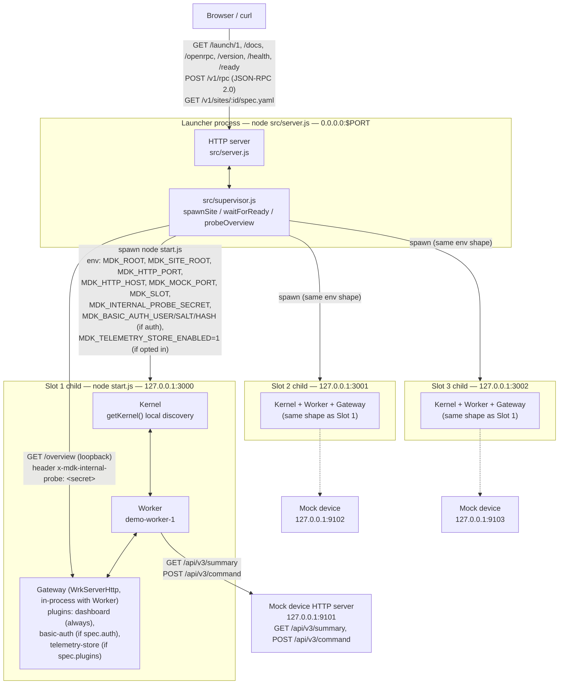
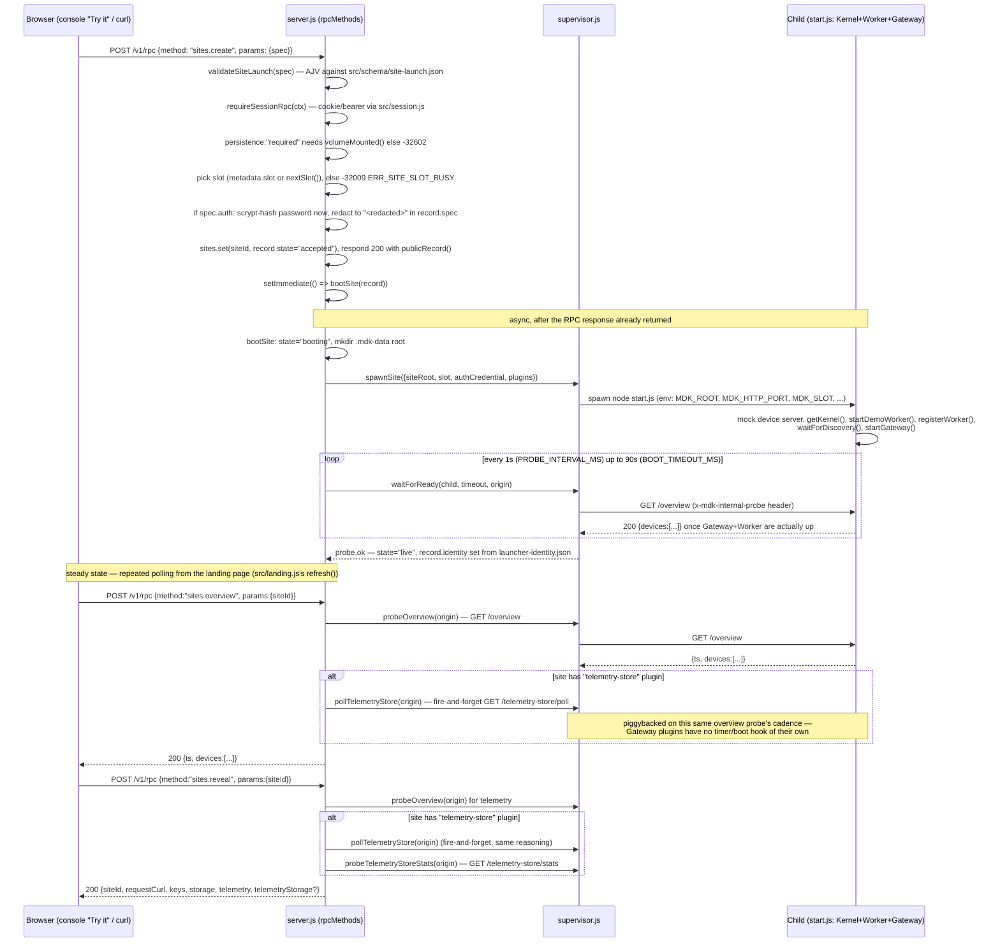

# Architecture

This document describes the system as it exists in this checkout of `http-mdk-launch`
(branch `0.6-railway`), grounded in the actual source files listed inline below — not in
the project plan (`/Users/harriebickle/GitHub/Tether/Railway/maintainers/README.md`,
which describes the *staged plan* this system implements) and not in the `design/`
directory (which describes work that is designed but, in several cases, only partly
wired in — flagged explicitly below wherever that matters).

If you have zero context on how this repo works, read this document top to bottom before
touching code. For the `/docs` interactive console specifically, see `maintainers/console.md`
instead — it is the least self-explanatory part of this codebase and gets its own deep dive.

## 1. What this is

A small Node HTTP service (`src/server.js`) that accepts an authenticated JSON-RPC 2.0
request and, in response, spawns and supervises up to three independent MDK "sites" —
each a full Kernel + Worker + Gateway stack from the pinned public MDK `v0.6.0` runtime
(checked out as the sibling directory `../mdk`, referenced here as `MDK_ROOT`). The
launcher itself never touches the Kernel/Worker/Gateway APIs directly; it spawns a child
Node process per site (`templates/minimal-site/start.js`) that does that wiring, and it
talks to that child only over loopback HTTP.

## 2. Process and component topology

One launcher process, `0.0.0.0:$PORT` (`src/server.js`, `PORT = Number(process.env.PORT) || 8080`,
`server.listen(PORT, '0.0.0.0', ...)`). Up to three child processes, one per "slot"
(`MAX_SLOTS = 3` in `src/server.js`), each spawned by `src/supervisor.js`'s `spawnSite()`
as `node start.js` bound to loopback only. Slot *n*'s Gateway listens on
`127.0.0.1:299{9+n}` and its mock device server on `127.0.0.1:9100+n`
(`src/paths.js`'s `gatewayOrigin(slot)`: `port: 2999 + n`, `mockPort: 9100 + n`) — so slot 1
is `127.0.0.1:3000` / `127.0.0.1:9101`, slot 2 is `127.0.0.1:3001` / `127.0.0.1:9102`, slot 3
is `127.0.0.1:3002` / `127.0.0.1:9103`.

Inside each child (`templates/minimal-site/start.js`'s `main()`):

1. Starts the mock device HTTP server first (`demoMock.createServer` from
   `../mdk/backend/workers/samples/demo-worker/mock/server.js` — a fake "WM3" miner
   firmware exposing `GET /api/v3/summary` and `POST /api/v3/command`, nothing MDK-aware).
2. `getKernel({ root, keyFile, topicFile, discovery: { mode: 'local', dir } })` — from
   `../mdk/backend/core/mdk/index.js`. `discovery.mode: 'local'` means workers register by
   publishing their HRPC key to a shared directory under `.mdk-data/.worker-keys` instead
   of a DHT topic — the fast same-machine path, appropriate since Kernel/Worker/Gateway are
   one process here.
3. `startDemoWorker(...)` from `../mdk/examples/backend/demo-worker-caller`, seeded with the
   one mock device.
4. `kernel.registerWorker(...)` then `waitForDiscovery(kernel, { minWorkers: 1 })` — polls
   `kernel.registry.listWorkers()` every 500ms (`intervalMs`) up to 30s (`timeoutMs`) until
   the worker is `READY` with at least one device.
5. `startGateway({ kernel, port, root, extraPluginDirs, httpd: { h0: { host } } })` — also
   from `../mdk/backend/core/mdk/index.js`. This constructs a `WrkServerHttp` **in the same
   process**, not a further fork — the Gateway's plugin controllers literally share
   `process.env` and the Node module cache with `start.js` and with each other (this is why
   `templates/minimal-site/plugins/telemetry-store/lib/store.js` and
   `plugins/basic-auth/lib/guard.js` can read `process.env.MDK_SITE_ROOT` /
   `MDK_BASIC_AUTH_USER` directly with no extra plumbing through Gateway services).

Gateway plugins loaded via `extraPluginDirs` (built up in `start.js`):

- `plugins/dashboard` — **always loaded**. One route, `GET /overview`
  (`templates/minimal-site/plugins/dashboard/mdk-plugin.json`, package
  `@tetherto/mdk-plugin-minimal-site`), which lists every worker's devices and pulls live
  telemetry per device. This is the only route the launcher's own supervisor and RPC layer
  ever call.
- `plugins/basic-auth` — loaded only `if (process.env.MDK_BASIC_AUTH_USER)`, i.e. only when
  the site's spec included `spec.auth`. Adds `GET /auth-overview` (a demonstration route,
  a copy of `dashboard.overview` with the guard applied) and provides the shared
  `requireBasicAuth()` guard other controllers can opt into.
- `plugins/telemetry-store` — loaded only `if (process.env.MDK_TELEMETRY_STORE_ENABLED === '1')`,
  i.e. only when `spec.plugins` included `"telemetry-store"`. Adds
  `GET /telemetry-store/poll` (pulls + appends), `GET /telemetry-store/history`, and
  `GET /telemetry-store/stats`.

> **A discrepancy worth knowing about, not silently smoothing over:** both
> `plugins/basic-auth/mdk-plugin.json` and `plugins/telemetry-store/mdk-plugin.json`
> describe themselves in their own `description` field as `"DESIGN PROTOTYPE (not wired
> into templates/minimal-site)"`. That description is **stale relative to the actual code**
> in this checkout: `templates/minimal-site/start.js` does conditionally push both plugin
> directories into `extraPluginDirs`, `src/supervisor.js`'s `spawnSite()` does set the env
> vars that trigger that, `src/server.js`'s `createSiteRpc()` does hash and forward
> `spec.auth`, `src/schema/site-launch.json` does accept both `spec.auth` and
> `spec.plugins: ["telemetry-store"]`, and `test/validate.test.js` / `test/server-auth.test.js`
> exercise all of this. Both plugins are real and wired, end to end, in this repo today —
> only their own `mdk-plugin.json` prose hasn't been updated to say so. Don't propagate the
> "design prototype" framing into new work without re-checking; it will keep being wrong in
> exactly the direction that erases a real, tested feature.

## 3. `sites.create` → boot → steady-state lifecycle

Every mutating call goes through one JSON-RPC dispatch point:
`POST /v1/rpc` → `handle()` → `dispatchRpc(req, body)` → `rpcMethods[method](params, ctx)`
(all in `src/server.js`). `dispatchRpc` builds a `ctx = { req, extraHeaders: {} }`, catches
`RpcError` and turns it into a JSON-RPC error object, and always responds `HTTP 200` — JSON-RPC
errors are payload-level (`error.code`, e.g. `-32001` unauthorized, `-32009` slot busy), not
HTTP status codes. See `openrpc/launch.openrpc.json` for the full method list, params, and
per-method `errors` — that file, not this doc, is the frozen contract.

Slot bookkeeping lives in two in-memory `Map`s at module scope in `src/server.js`: `sites`
(siteId → record) and `children` (slot → child process handle). There is no database —
restarting the launcher process loses all site state (this is explicitly a known,
documented gap: see `/Users/harriebickle/GitHub/Tether/Railway/maintainers/README.md`'s
"Stage 3 exit" / "restart-reconciliation ... not implemented yet"). `recordForSlot(slot)`
scans `sites.values()` for a non-terminal record in that slot; `nextSlot()` picks the first
empty slot 1–3.

Key file-level details behind the diagram:

- **Boot timeout / probe interval**: `src/supervisor.js`, `BOOT_TIMEOUT_MS = Number(process.env.MDK_BOOT_TIMEOUT_MS) || 90_000`, `PROBE_INTERVAL_MS = 1_000`.
- **Internal probe secret**: `src/supervisor.js` generates `INTERNAL_PROBE_SECRET` (24 random bytes, hex) once per launcher process — never persisted or logged — and sends it as the `x-mdk-internal-probe` header on every `probeOverview`/`probeTelemetryStoreStats`/`pollTelemetryStore` call. `templates/minimal-site/plugins/dashboard/controllers/overview.js` checks this header (via `MDK_INTERNAL_PROBE_SECRET`, set as an env var on the child) *before* enforcing `requireBasicAuth()`, specifically so the launcher's own boot/steady-state polling isn't blocked by a site's own Basic Auth credential (which the launcher deliberately never retains in plaintext — see §5).
- **Exit handling**: `bootSite()` registers `child.once('exit', ...)` — an unexpected exit while `booting` or `live` moves the record to `failed` with `ERR_SITE_EXITED` and deletes the `children` map entry.
- **Stop**: `stopSite()` → `stopChild()` sends `SIGTERM`, waits up to `gracefulMs` (8s default), then `SIGKILL`s.

## 4. Storage: what lives where

Every site gets a working directory `dataRoot()/sites/<siteId>/.mdk-data`
(`src/paths.js`: `dataRoot()` is `process.env.LAUNCHER_DATA_DIR || <repo>/.data`; on Railway
this is expected to be under the mounted volume, default `/data`, via `RAILWAY_VOLUME_MOUNT_PATH`
per `src/server.js`'s `VOLUME_ROOT`).

| Path (under `.mdk-data/`) | What it is | Written by |
| --- | --- | --- |
| `.kernel-key`, `.dht-topic` | Kernel HRPC identity / DHT topic file | `getKernel()` in `../mdk/backend/core/mdk/index.js` |
| `.worker-keys/` | Local-discovery: workers publish their HRPC key here for the Kernel to pick up (no DHT hop) | `getKernel({ discovery: { mode: 'local' } })` |
| `demo-worker-store/` | Worker runtime's own Corestore/Hyperbee state | `startDemoWorker()` (`../mdk/examples/backend/demo-worker-caller`) |
| `gateway/` | Gateway's config/db/store/workers dirs (`startGateway({ root, tmpdir })`) | `startGateway()` |
| `launcher-identity.json` | `{ gateway, kernel: {publicKeyFingerprint, short}, worker: {...} }` — read back by `src/server.js` via `readIdentity()`/`publicIdentity()` (`src/identity.js`) once boot succeeds | `templates/minimal-site/start.js`'s `main()` |
| `telemetry-store/telemetry.csv` + `telemetry.csv.stats.json` | Append-only CSV of every polled telemetry sample, plus a small JSON sidecar cache of `rowCount`/`firstObservedAt`/`lastObservedAt` (survives Gateway restart without losing growth-rate math) | `plugins/telemetry-store/lib/store.js` — **only present if the site opted into `spec.plugins: ["telemetry-store"]`** |

At the Corestore/Hyperbee level specifically: `src/server.js`'s `revealStorage()` (used by
`sites.reveal`) points at `<siteRoot>/store/http/CORESTORE` as "Corestore-backed Hyperbee
state" — this is the Gateway's own store directory (the `WrkServerHttp`/`tether-wrk-base`
corestore), separate from the Kernel's and Worker's own stores listed above.

**`ephemeral` vs `required` persistence** (`SiteLaunch.spec.persistence`, validated by
`src/schema/site-launch.json`, enforced in `src/server.js`'s `createSiteRpc()`):

- `persistence: "required"` — rejected with `ERR_VOLUME_REQUIRED` unless `volumeMounted()`
  (i.e. `VOLUME_ROOT` exists and is a directory — a real Railway volume mount, not a
  simulated one). When accepted, `.mdk-data` lives under that mounted volume and survives a
  launcher restart.
- `persistence: "ephemeral"` (or the field simply not `"required"`) — `.mdk-data` lives on
  local container/disk storage under `<repo>/.data/sites/<siteId>` and is gone the moment
  the site stops or the launcher restarts.

## 5. BYOT vs. MDK-core provenance

`openrpc/launch.openrpc.json` tags every method with `x-provenance`: `"byot"` for methods
that are entirely launcher-owned control-plane logic (`session.*`, `auth.createWallet`,
`sites.validate`, `sites.get`, `sites.stop`, `sites.notes.set`) and `"mixed"` for the three
methods that actually reach into the real MDK runtime — `sites.create` (spawns a real
Kernel/Worker/Gateway), `sites.overview` and `sites.reveal` (both proxy a real HTTP probe of
a child's Gateway). As of this checkout that's 8 `byot` methods (`session.me`,
`auth.createWallet`, `session.create`, `session.logout`, `sites.validate`, `sites.get`,
`sites.stop`, `sites.notes.set`) and 3 `mixed` methods (`sites.create`, `sites.overview`,
`sites.reveal`) — counted directly from the spec's `x-provenance` fields, method by method;
recount if a method is added rather than trusting this number later. Treat
`openrpc/launch.openrpc.json` as the living source of truth for this split; don't duplicate
the per-method reasoning here, it will drift.

## 6. "If you want to change X, start at file Y"

| Change | Start here |
| --- | --- |
| Add a new RPC method | Add an `async 'name.here' (params, ctx) {...}` entry to `rpcMethods` in `src/server.js`; add the method to `openrpc/launch.openrpc.json` (params/result/errors/`tags`/`examples` — the console renders directly from this file, see `maintainers/console.md`); if it needs a session, call `requireSessionRpc(ctx)` first; if it needs request-body validation, follow `validateSiteLaunch`'s pattern (AJV schema under `src/schema/`) rather than hand-rolling checks. |
| Add a new Gateway plugin | Create `templates/minimal-site/plugins/<name>/` with a `mdk-plugin.json` (`routes: [{id, handler, http: {method, path}, ...}]`) and `controllers/*.js` files, following `plugins/dashboard` (simplest, always-on) or `plugins/telemetry-store` (opt-in via `spec.plugins`, has its own `lib/store.js`) as a template. Wire the opt-in in `templates/minimal-site/start.js`'s `extraPluginDirs` push (gate it on a new env var), set that env var in `src/supervisor.js`'s `spawnSite()` based on `spec.plugins`, and add the plugin name to the `enum` in `src/schema/site-launch.json`'s `spec.plugins.items`. Remember: plugin controllers run in the **same process** as `start.js` (`startGateway()` is in-process, not a fork — see §2), so `process.env` is shared directly, no extra plumbing needed. |
| Add a new worker type | **Not implemented today — do not assume it exists.** `design/site-config-v2.md` proposes a `spec.worker.type` field (`miner` \| `temperature-sensor` \| `power-meter`), but per `/Users/harriebickle/GitHub/Tether/Railway/maintainers/README.md`'s "Product truth" correction, a real 0.6-compatible `temperature-sensor` worker package does not exist yet in the pinned `../mdk` tree and would have to be built against 0.6's `WorkerRuntime` (`backend/workers/samples/demo-worker`'s actual shape), not ported from `examples/dashboard-workbench`'s `WorkerRuntimeV2`-based version (that's a 0.7-only API). If you pick this up: start from `templates/minimal-site/start.js`'s `startDemoWorker`/`demoMock` calls and `src/schema/site-launch.json`, but expect to write a new worker package first. |
| Change session/auth behavior | `src/session.js` (HMAC-signed cookie, `LAUNCHER_PUBLIC_KEYS` allowlist, `SESSION_TTL_SEC`) and `src/wdk.js` (BIP-39 seed → Solana-derived public key, via `@tetherto/wdk-wallet-solana`). RPC-level session enforcement is `requireSessionRpc()` in `src/server.js`, called at the top of every session-gated method. |
| Change what's proxied/allowlisted | The allowlist *is* the `rpcMethods` object in `src/server.js` plus the small set of plain-HTTP routes in `handle()` (`/health`, `/ready`, `/v1/sites/:id/spec.yaml`, `/docs*`, `/app.css`, `/openrpc`) — there is no separate config file. `src/supervisor.js`'s `proxyOverview()` exists but is unused by the current RPC-based `sites.overview` (which calls `probeOverview()` directly and returns its JSON body as the RPC result, not a raw proxied HTTP response) — don't assume `proxyOverview` is wired into anything today. |
| Add `spec.deployment.gateway: "disabled"` (Gateway-optional boot) | Proposed, not implemented — see `design/site-config-v2.md` and `/Users/harriebickle/GitHub/Tether/Railway/plans/mdk-0.6-gateway-optionality.md`. Today `sites.overview`/`sites.reveal`'s telemetry is 100% sourced from the one `GET /overview` HTTP probe with zero HRPC fallback; skipping Gateway would need a defined "no Gateway" response shape and a boot-readiness signal other than HTTP polling (e.g. the child's `mdk-ready` stdout line). |

## 7. What's designed but not implemented (do not build on top of this as if it exists)

Everything under `design/` (`site-config-v2.md`, `plugin-basic-auth.md`,
`plugin-telemetry-store.md`, `plugins-fragment.json`, `plugins/`) is proposal material. Two
of those proposals — `basic-auth` and `telemetry-store` — are, confusingly, *actually wired
in* today (see the callout in §2); the rest (new worker types, `spec.deployment.gateway`)
are genuinely not. When in doubt, check `src/schema/site-launch.json` (what the validator
actually accepts) and `templates/minimal-site/start.js` (what actually gets loaded) rather
than trusting a `design/*.md` file's framing of its own status.
